# Distributed Key-Value Store

A horizontally scalable, fault-tolerant distributed Key-Value store with sharding, replication, and centralized orchestration.

---

## 🧠 Architecture Overview

This system consists of:
- A **Master Server** responsible for routing, sharding, and cluster metadata
- Multiple **Storage Nodes** responsible for durable data storage
- Clients interact with the system via a unified API Gateway

---

## 👑 Master Node Architecture

```mermaid
graph TD
    %% External Client actor
    Client[👤 External Client]

    %% The Master Server Subsystem
    subgraph MasterGroup ["👑 Master Server (Orchestrator)"]
        direction TB
        APIGateway["🚪 API Gateway / Load Balancer"]
        ShardingLogic["🧮 Sharding & Router Logic<br/>(Hash key → Node IP)"]
        MetadataStore[("📒 Cluster Metadata<br/>(Node Inventory & Health)")]
    end

    %% The Cluster of Storage Nodes
    subgraph StorageCluster ["🧱 Storage Cluster (Data Nodes)"]
        direction LR
        Node1[("📦 Node 1<br/>(:3001)")]
        Node2[("📦 Node 2<br/>(:3002)")]
        Node3[("📦 Node 3<br/>(:3003)")]
    end

    %% Flows
    Client -->|"1. PUT /key (Save Data)"| APIGateway
    APIGateway --> ShardingLogic
    ShardingLogic -.->|"Lookup Active Nodes"| MetadataStore
    
    %% Replication Flow (Fan-out)
    %% CHANGED: Used HTML codes for parentheses to fix parser error
    ShardingLogic ==>|2. Stream Data #40;Replica 1#41;| Node1
    ShardingLogic ==>|2. Stream Data #40;Replica 2#41;| Node2
    ShardingLogic -.->|2. Stream Data #40;Replica 3 - Optional#41;| Node3

    %% Node Indepedence
    Node1 --- Disk1[(Disk 1)]
    Node2 --- Disk2[(Disk 2)]
    Node3 --- Disk3[(Disk 3)]

    style APIGateway fill:#e3f2fd,stroke:#1565c0,color:#000
    style ShardingLogic fill:#fff9c4,stroke:#fbc02d,color:#000
    style MetadataStore fill:#fce4ec,stroke:#c2185b,color:#000
    style Node1 fill:#e8f5e9,stroke:#2e7d32,color:#000
    style Node2 fill:#e8f5e9,stroke:#2e7d32,color:#000
    style Node3 fill:#e8f5e9,stroke:#2e7d32,color:#000
```

## Storage Engine Architecture

```mermaid
graph TD
    subgraph NodeInternals ["Storage Node (Single Go Binary)"]
        direction TB
        
        %% Network Interface Layer
        HttpLayer[("📢 Network Layer<br/>(Go net/http Listener)")]
        
        %% Business Logic Layer
        LogicLayer["⚙️ Business Logic / API Handler<br/>(Validation, TTL, Stream handling)"]
        
        %% Storage Engine Layer
        BadgerEngine[("🦁 Embedded Storage Engine<br/>(BadgerDB Library)")]
        
        %% Physical Storage
        Disk[(💾 Physical Disk / SSD<br/>Badger vlog/sst files)]

        %% Flows
        ExternalRequest["External Request<br/>(from Master or Client)"] -->|HTTP PUT/GET| HttpLayer
        HttpLayer -->|Parse Request| LogicLayer
        LogicLayer -->|txn.SetEntry / txn.Get| BadgerEngine
        BadgerEngine -->|High-Perf IO| Disk
    end

    style HttpLayer fill:#e1f5fe,stroke:#01579b,stroke-width:2px,color:#000
    style LogicLayer fill:#fff3e0,stroke:#e65100,stroke-width:2px,color:#000
    style BadgerEngine fill:#e8f5e9,stroke:#1b5e20,stroke-width:2px,color:#000
```

